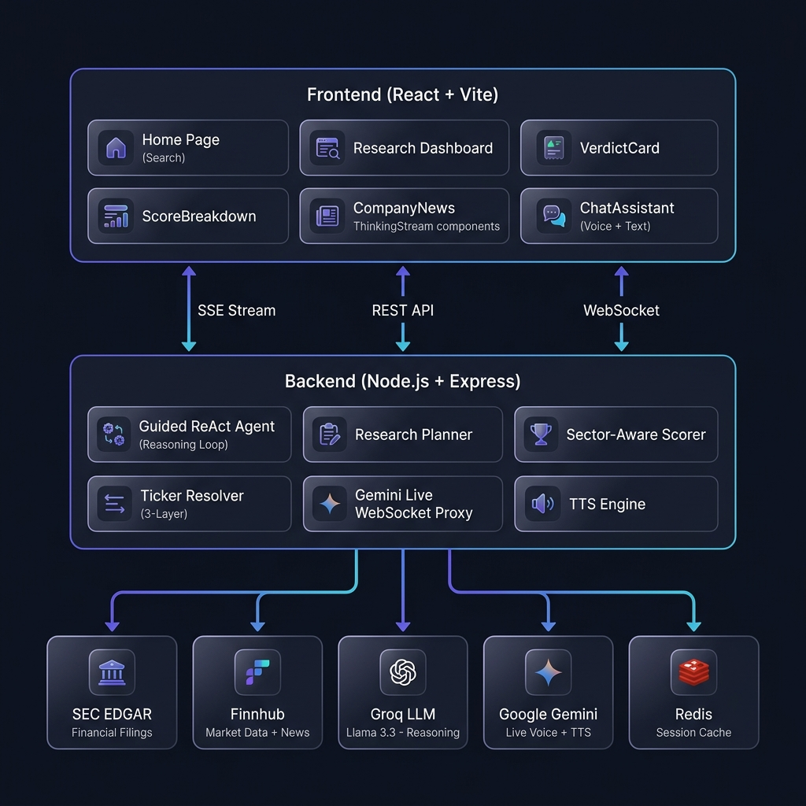
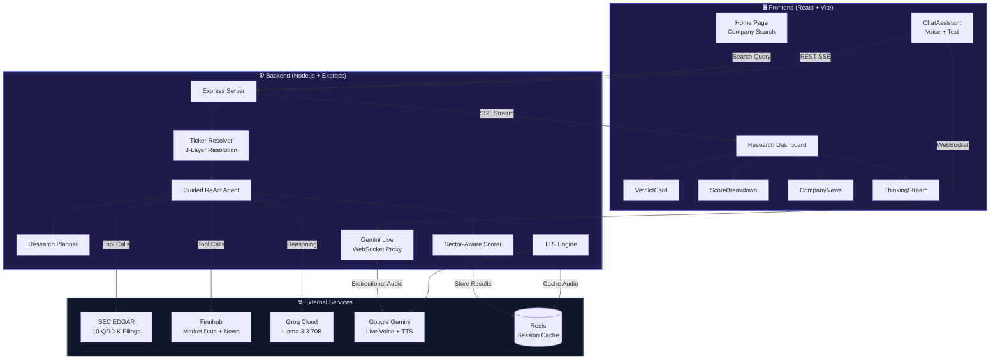
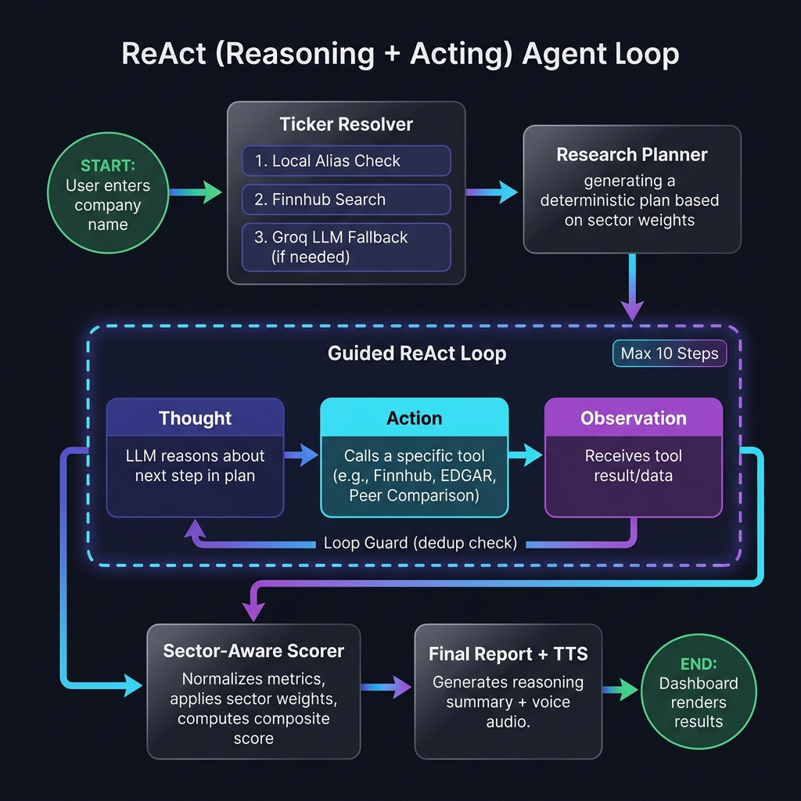
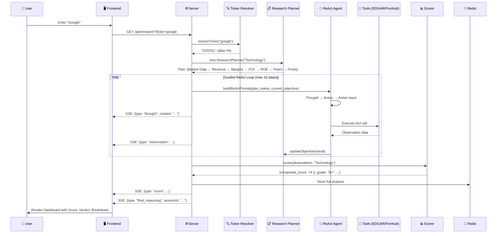
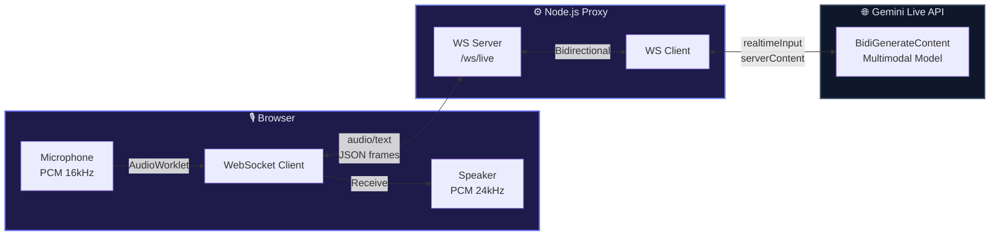

<p align="center">
  
  
  
  
  
</p>

<h1 align="center">🧠 AI Investment Research Agent</h1>

<p align="center">
  <strong>An autonomous AI agent that performs institutional-grade equity research in real-time</strong><br/>
  <em>Powered by a Guided ReAct reasoning engine, SEC EDGAR filings, Finnhub market data, and a multilingual voice assistant</em>
</p>

<p align="center">
  <a href="#-why-this-matters">Why This Matters</a> •
  <a href="#-key-features">Features</a> •
  <a href="#-system-architecture">Architecture</a> •
  <a href="#-multilingual-voice-assistant">Voice Assistant</a> •
  <a href="#-getting-started">Getting Started</a> •
  <a href="#-tech-stack">Tech Stack</a>
</p>

---

## 🎯 Why This Matters

Retail investors are at a **structural disadvantage**. Institutional firms spend **$15,000–$30,000/year** per analyst seat on Bloomberg terminals and have entire research departments. Individual investors rely on surface-level metrics, clickbait headlines, and gut instinct.

**This project bridges that gap.**

The AI Investment Research Agent democratizes equity research by combining:

- 🤖 **Autonomous reasoning** — A Guided ReAct (Reasoning + Acting) agent that thinks step-by-step, just like a professional analyst
- 📊 **Real financial data** — Pulls directly from **SEC EDGAR** (10-Q/10-K filings) and **Finnhub** (live market data, news)
- 🏭 **Sector-aware scoring** — Dynamically adjusts evaluation metrics based on sector (a bank is scored differently than a SaaS company)
- 🎙️ **Multilingual voice assistant** — Talk to the AI about your research in **any language** via Gemini Live bidirectional audio
- 📈 **Peer benchmarking** — Automatically identifies competitors and ranks performance relative to peers

> **The result:** Enter any US-listed company name — even just "Google" or "Tesla" — and receive a comprehensive, scored, voice-narrated fundamental analysis in under 30 seconds.

---

## ✨ Key Features

### 🔍 Intelligent Ticker Resolution
A 3-layer resolution system that understands natural language:
| Layer | Method | Example |
|-------|--------|---------|
| 1 | Local alias map (90+ companies) | `"google"` → `GOOGL` |
| 2 | Finnhub symbol search API | `"snowflake"` → `SNOW` |
| 3 | Groq LLM fallback (Llama 3.3 70B) | `"the electric car company"` → `TSLA` |

Private companies and international tickers are automatically detected and filtered with clear user feedback.

### 🧠 Guided ReAct Reasoning Engine
The agent doesn't just fetch data — it **reasons** about what data to collect, in what order, and why:

```
Thought: I need to start with market data for AAPL to understand the current valuation.
Action: finnhub_market_data
Action Input: {"ticker": "AAPL"}
Observation: [Market data received — PE: 28.5, Market Cap: $3.2T]

Thought: Now I should examine revenue growth trends from SEC filings...
Action: edgar_financials  
Action Input: {"ticker": "AAPL", "metric": "revenue_growth"}
```

Key agent capabilities:
- **Deterministic research plans** generated from sector-specific weight configurations
- **Loop guard** prevents duplicate API calls
- **Circuit breaker** skips remaining EDGAR calls if CIK lookup fails
- **Error recovery** with structured retry logic (rate limits, network errors)

### 📊 Sector-Aware Composite Scoring
The scoring engine supports **50+ sector/sub-sector** weight configurations:

- **Technology:** Revenue growth (30%), Gross margin (25%), FCF (25%), ROE/ROIC (20%)
- **Financials:** NIM (30%), Loan growth (25%), Tier 1 capital (25%), ROE (20%)
- **REITs:** FFO, AFFO, Occupancy, Same-store NOI, Debt (with sub-types: Hotel, Retail, Industrial, Office, Residential, Data Center, Healthcare)
- **Healthcare:** Revenue growth, Operating margin, Medical cost ratio, FCF, EPS
- And many more...

Each metric is normalized to a 0-100 scale, weighted by sector importance, and combined into a single composite score with letter grade (A+ through D).

### 🎙️ Multilingual Voice Assistant
The **Gemini Live** integration provides a context-aware, real-time voice assistant that:

- **Speaks and understands any language** — Talk in English, Hindi, Spanish, Japanese, or any other language
- **Knows your research** — The assistant has full context of the completed analysis (scores, metrics, risks, raw data)
- **Bidirectional audio** — Uses WebSocket streaming with PCM audio at 16kHz input / 24kHz output
- **Text chat fallback** — Also supports typed conversations via Groq-powered streaming SSE

### 🔊 Text-to-Speech Analysis Narration
After research completes, the agent's reasoning summary is automatically converted to speech using **Gemini 2.5 Flash TTS**, cached in Redis, and available for instant playback.

### 📡 Real-Time Streaming UI
The entire research process streams to the frontend in real-time via **Server-Sent Events (SSE)**:
- Live thinking/reasoning trace
- Progressive score updates
- Tool call execution visibility
- Final verdict with animated score ring

---

## 🏗️ System Architecture

### High-Level Overview



### Detailed Architecture Diagram



### ReAct Agent Reasoning Flow





### WebSocket Voice Architecture



---

## 🗣️ Multilingual Voice Assistant

The Gemini Live integration is a **first-class feature**, not an afterthought. It enables:

### How It Works
1. **WebSocket Proxy** — The backend establishes a persistent bidirectional WebSocket to Google's `BidiGenerateContent` endpoint
2. **Context Injection** — Full research context (scores, metrics, risks, raw financial data) is injected as the system instruction
3. **Audio Pipeline** — Browser captures microphone via AudioWorklet → PCM 16-bit 16kHz → Base64 → WebSocket → Gemini → Response audio 24kHz → Speaker
4. **Pre-connected** — The WebSocket connects eagerly when research completes, so there's zero delay when you click the mic

### Supported Languages
Since it's powered by Gemini's multimodal model, the assistant supports **100+ languages** including but not limited to:

| Language | Status | Language | Status |
|----------|--------|----------|--------|
| 🇺🇸 English | ✅ Native | 🇮🇳 Hindi | ✅ Full Support |
| 🇮🇳 Bengali | ✅ Full Support | 🇮🇳 Punjabi | ✅ Full Support |
| 🇮🇳 Odia | ✅ Full Support | 🇮🇳 Tamil | ✅ Full Support |
| 🇮🇳 Telugu | ✅ Full Support | 🇮🇳 Marathi | ✅ Full Support |
| 🇮🇳 Gujarati | ✅ Full Support | 🇮🇳 Kannada | ✅ Full Support |

> **You can speak in any language**, and the assistant will respond in the same language while referencing the actual financial data from your research.

---

## 📁 Project Structure

```
AI-Investment-Agent/
├── backend/
│   ├── src/
│   │   ├── server.js              # Express server, SSE endpoints, TTS, chat API
│   │   ├── config.js              # Environment variable exports
│   │   ├── redisClient.js         # Redis (ioredis) connection
│   │   ├── geminiLive.js          # Gemini Live WebSocket proxy (bidirectional audio)
│   │   ├── agent/
│   │   │   ├── reactAgent.js      # Guided ReAct agent (Thought → Action → Observation loop)
│   │   │   ├── planner.js         # Deterministic research plan generator
│   │   │   ├── promptTemplates.js # System + ReAct prompt construction
│   │   │   ├── memory.js          # Short-term session memory (Redis-backed)
│   │   │   ├── loopGuard.js       # Duplicate tool call prevention
│   │   │   └── toolRouter.js      # Tool name → function dispatcher
│   │   ├── tools/
│   │   │   ├── tickerResolver.js  # 3-layer ticker resolution (alias → Finnhub → LLM)
│   │   │   ├── finnhubTool.js     # Finnhub market data, profile, metrics, news
│   │   │   ├── edgarTool.js       # SEC EDGAR XBRL financial data extraction
│   │   │   └── peerTool.js        # LLM-powered peer identification + benchmarking
│   │   └── scorer/
│   │       ├── scorer.js          # Sector-aware composite scoring engine
│   │       ├── normalizer.js      # Metric normalization (0-100 scale)
│   │       └── sectorWeights.js   # 50+ sector/sub-sector weight configurations
│   ├── .env.example               # ⬅ Template — copy to .env and fill in your API keys
│   └── package.json
│
├── frontend/
│   ├── src/
│   │   ├── App.jsx                # React Router setup
│   │   ├── main.jsx               # Entry point
│   │   ├── pages/
│   │   │   ├── Home.jsx           # Search landing page with popular tickers
│   │   │   └── Research.jsx       # Research dashboard (SSE consumer, state reducer)
│   │   ├── components/
│   │   │   ├── VerdictCard.jsx    # Animated score ring + grade + verdict
│   │   │   ├── ScoreBreakdown.jsx # Metric-by-metric breakdown bars
│   │   │   ├── CompanyNews.jsx    # Latest company news cards
│   │   │   ├── ThinkingStream.jsx # Live agent reasoning trace
│   │   │   ├── ChatAssistant.jsx  # Voice + text chat (WebSocket + REST)
│   │   │   └── SearchBar.jsx      # Reusable search input
│   │   ├── lib/
│   │   │   ├── config.js          # API_BASE / WS_BASE (auto-detects local vs production)
│   │   │   └── sseClient.js       # SSE stream consumer utility
│   │   └── styles/
│   │       └── index.css          # Global styles, glassmorphism, animations
│   ├── vercel.json                # Vercel SPA routing config
│   └── package.json
│
├── render.yaml                    # Render deployment blueprint (backend + Redis)
├── docs/                          # Architecture diagrams
├── .gitignore
└── README.md
```

---

## 🚀 Getting Started

### Prerequisites

- **Node.js** ≥ 18.x — [Download](https://nodejs.org/)
- **Redis** server — [Install guide](#install-redis)
- **API Keys** (all free tier):

| Service | Purpose | Get Key |
|---------|---------|---------|
| **Groq** | LLM reasoning (Llama 3.3 70B) | [console.groq.com](https://console.groq.com) |
| **Finnhub** | Market data, news, company profiles | [finnhub.io](https://finnhub.io) |
| **Google Gemini** | Voice assistant + TTS | [aistudio.google.com](https://aistudio.google.com) |
| **SEC EDGAR** | Requires a User-Agent string (no signup) | [sec.gov/developer](https://www.sec.gov/developer) |

### Installation

**1. Clone the repository**
```bash
git clone https://github.com/ashish3120/AI-Investment-Agent.git
cd AI-Investment-Agent
```

**2. Install dependencies**
```bash
# Backend
cd backend
npm install

# Frontend
cd ../frontend
npm install
```

**3. Set up environment variables**
```bash
# From the project root
cd backend
cp .env.example .env
```
Now open `backend/.env` and fill in your API keys. The file has comments explaining each variable:

```env
# ── Groq (LLM Reasoning) ─────────────────────────────────────────
GROQ_API_KEY=your_groq_api_key_here

# ── Finnhub (Market Data) ────────────────────────────────────────
FINNHUB_API_KEY=your_finnhub_api_key_here

# ── Google Gemini ─────────────────────────────────────────────────
gemini-3.1-flash-live-preview_api=your_gemini_api_key_here

# ── SEC EDGAR ─────────────────────────────────────────────────────
SEC_USER_AGENT=YourName your@email.com

# ── Redis ─────────────────────────────────────────────────────────
REDIS_URL=redis://localhost:6379
```


<a name="install-redis"></a>
**4. Install & Start Redis**

| OS | Command |
|----|---------|
| **Windows** | Download from [github.com/microsoftarchive/redis/releases](https://github.com/microsoftarchive/redis/releases) or use WSL: `sudo apt install redis-server && redis-server` |
| **macOS** | `brew install redis && redis-server` |
| **Linux (Ubuntu/Debian)** | `sudo apt install redis-server && sudo systemctl start redis` |

Verify Redis is running:
```bash
redis-cli ping
# Should return: PONG
```

**5. Start the application**

Open **two terminals**:

```bash
# Terminal 1 — Backend (runs on port 8000)
cd backend
npm run dev
```

```bash
# Terminal 2 — Frontend (runs on port 5173)
cd frontend
npm run dev
```

**6. Open your browser**

Navigate to **http://localhost:5173** and enter any company name (e.g., "Apple", "Tesla", "NVDA") to begin research.

---

## 🛠️ Tech Stack

### Backend
| Technology | Purpose |
|------------|---------|
| **Node.js + Express** | HTTP server, SSE streaming, REST APIs |
| **Groq SDK** | LLM inference (Llama 3.3 70B Versatile + 8B Instant) |
| **Google GenAI SDK** | Gemini TTS + Live multimodal voice |
| **WebSocket (ws)** | Bidirectional audio proxy to Gemini Live |
| **ioredis** | Session caching, TTS audio storage |
| **Axios** | HTTP client for Finnhub + SEC EDGAR APIs |

### Frontend
| Technology | Purpose |
|------------|---------|
| **React 18** | UI framework with hooks + useReducer |
| **Vite 5** | Dev server + bundler |
| **React Router 6** | Client-side routing |
| **Tailwind CSS 3** | Utility-first styling |
| **Web Audio API** | Microphone capture + audio playback |
| **AudioWorklet** | Real-time PCM encoding in a separate thread |

### External APIs
| API | Data Provided |
|-----|---------------|
| **SEC EDGAR XBRL** | Revenue, EPS, margins, FCF, debt, ROE — last 8 quarters |
| **Finnhub** | Price, market cap, PE/PS/PB ratios, beta, 52-week range, news |
| **Groq (Llama 3.3)** | Agent reasoning, peer identification, ticker resolution, REIT classification |
| **Google Gemini Live** | Real-time voice conversation with research context |
| **Google Gemini TTS** | Text-to-speech narration of analysis summary |

---

## 📊 Scoring Methodology

The composite score is calculated using a **sector-weighted normalization** approach:

1. **Data Collection** — The ReAct agent gathers 4-8 financial metrics per company from SEC EDGAR and Finnhub
2. **Normalization** — Each raw metric is normalized to a 0-100 scale using domain-specific ranges
3. **Sector Weighting** — Metrics are weighted based on what matters most for the sector (e.g., revenue growth is 30% for Tech but 15% for Consumer Staples)
4. **Peer Adjustment** — The peer rank from LLM-identified competitors adjusts the final score
5. **Confidence Scoring** — Data quality is tracked; low-confidence results are flagged

### Grading Scale
| Grade | Score Range | Interpretation |
|-------|------------|----------------|
| A+ | 85-100 | Exceptional fundamentals |
| A | 78-84 | Strong fundamentals, above-peer |
| B+ | 70-77 | Good fundamentals |
| B | 62-69 | Above average |
| C+ | 55-61 | Mixed signals |
| C | 45-54 | Below average |
| D | 0-44 | Elevated risk |

---

## 📜 License

This project is for **educational and research purposes only**. It does not constitute financial advice. Always do your own due diligence before making investment decisions.

---

<p align="center">
  <strong>Built with ❤️ using AI-powered reasoning</strong><br/>
  <sub>SEC EDGAR • Finnhub • Groq • Google Gemini • React • Node.js</sub>
</p>
