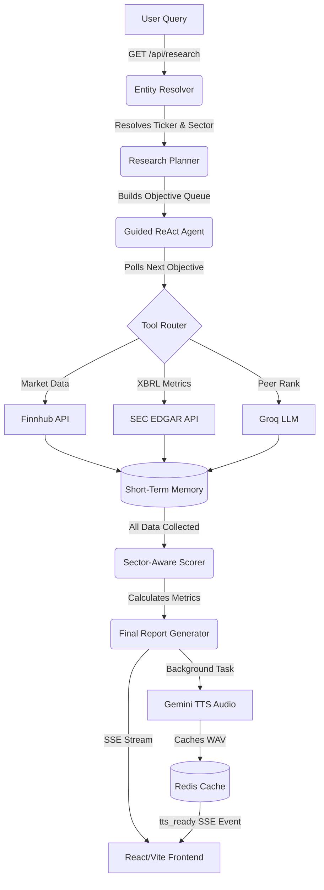

# AI-Investment-Agent

A production-grade, autonomous equity research AI agent that performs fundamental analysis, executes sector-specific research plans, fetches SEC financial data, identifies competitors, and delivers a narrated, concise investment summary.

## 🚀 Features

- **Autonomous Research Planner:** Deterministically structures sector-specific research objectives (e.g., pulling NIM for Banks, Medical Cost Ratios for Healthcare) before execution, eliminating LLM hallucinations and duplicate tool calls.
- **Guided ReAct Agent:** Leverages a lightweight `llama-3.3-70b-versatile` LLM (via Groq) to parse objectives, execute tool calls, and reason over extracted financial data.
- **Robust Tool Ecosystem:**
  - `finnhub_market_data`: Resolves tickers and extracts real-time market profile and pricing.
  - `edgar_financials`: Hits the SEC EDGAR XBRL taxonomy directly to pull quarters of specific fundamental growth metrics.
  - `advanced_peer_comparison`: Dynamically identifies top competitors via Groq and compares cross-industry metrics.
- **Dynamic Scoring & Normalization:** Calculates a composite fundamental score (0-100) using custom, sector-weighted heuristics.
- **Proactive TTS Architecture:** Generates an executive summary and proactively renders it to an audio stream in the background using `gemini-2.5-flash-preview-tts`, caching it via Redis for zero-latency UI playback.
- **Self-Healing Error Recovery:** The agent observes structured network or input errors and is capable of automatically adjusting inputs or skipping unavailable metrics.

## 🏗️ Architecture



1. **Frontend (React/Vite):** A stunning, responsive UI built with Tailwind CSS. It communicates with the backend via Server-Sent Events (SSE) to render the agent's real-time "Thought -> Action -> Observation" trace, and provides custom audio controls for the synthesized executive report.
2. **Backend (Node.js/Express):** Handles SSE streaming, orchestrates the Guided ReAct agent, manages short-term memory, and serves cached audio.
3. **Cache (Redis):** Stores generated `.wav` files indexed by `sessionId` for rapid frontend retrieval.

## 🛠️ Setup & Installation

### Prerequisites
- Node.js (v18+)
- Redis Server (or Docker to run the provided `redis/docker-compose.yml`)
- API Keys: [Groq](https://groq.com/), [Finnhub](https://finnhub.io/), and [Google Gemini](https://aistudio.google.com/)

### 1. Clone the Repository
```bash
git clone https://github.com/ashish3120/AI-Investment-Agent.git
cd AI-Investment-Agent
```

### 2. Backend Setup
```bash
cd backend
npm install
```
Create a `.env` file in the `backend` directory with the following variables:
```env
GROQ_API_KEY=your_groq_api_key
FINNHUB_API_KEY=your_finnhub_api_key
gemini_api_key=your_gemini_api_key
PORT=8000
```
Start the Redis server (if using Docker):
```bash
cd ../redis
docker-compose up -d
```
Start the backend development server:
```bash
npm run dev
```

### 3. Frontend Setup
```bash
cd ../frontend
npm install
npm run dev
```
The application will be running on `http://localhost:5173`.

## 🧠 Under the Hood

### Sector-Specific Metric Registry
The AI isn't forced to guess which metrics matter. The `ResearchPlanner` intercepts the sector from Finnhub and modifies the ReAct loop to strictly search for relevant metrics (e.g., Tech = FCF & ROIC, Financials = NIM & Tier 1 Capital).

### Zero-Latency TTS
Audio narration traditionally blocks the user experience while generating. This architecture emits the final reasoning text immediately, spawns a background thread to generate the Gemini voice file, caches the WAV in Redis, and pushes a `tts_ready` SSE event to the client to unlock the play button.

## 📝 License
MIT License
